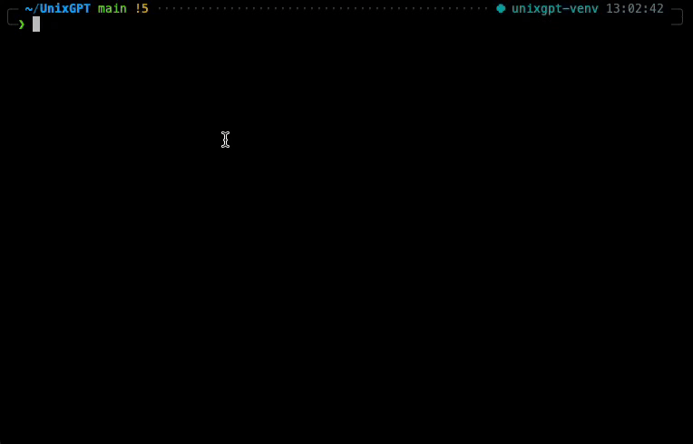

# UnixGPT



UnixGPT is a powerful tool that facilitates the transformation of natural language into UNIX commands, making it a user-friendly bridge between the two.

## Features
1. Conversion: Effortlessly convert natural language queries into the corresponding UNIX commands.

2. Command Options: After generating a command, you have the flexibility to:
- Execute: Directly execute the generated UNIX command.
- Save: Store frequently used commands locally for quick and easy access
- Copy: Copy the generated command to the clipboard for easy pasting and use in your terminal.

3. Reusability: Once a command is saved, easily access the command from storage with natural language or by ID

## Running locally (PyPI package coming soon)

- Ensure you have a valid OpenAI API Key (if not, get one here: https://openai.com/blog/openai-api)
- Add OpenAI API Key as environment variable

```bash
export OPENAI_API_KEY=
```

- Build package (in same directory as setup.py)

```bash
pip install .
```

- Run package with desired natural language input
```bash
unixgpt -i "[input here]"
```

## Examples

### Conversion

```
Input: unixgpt -i "I want to see any uses of the 'git commit' command in my history"

Output: history | grep "git commit"
```

```
Input: unixgpt -i "Use the Dockerfile in the cwd to create an image called project-image"

Output: docker build -t project-image .
```

```
Input: unixgpt --input "Show me the current processes running on port 8000"

Output: lsof -i :8000
```

### Save

```
Input: unixgpt -s "git commit && git push"

Output: "Added to UnixGPT local library"
```

```
Input: unixgpt --save 1599

Output: "Added to UnixGPT local library"
```

### Fetch

```
Input: unixgpt -f "command that commits and pushes via Git"

Output: git commit && git push
```

```
Input: unixgpt --fetch 23

Output: "Returns command in UnixGPT local library with ID:23"
```
